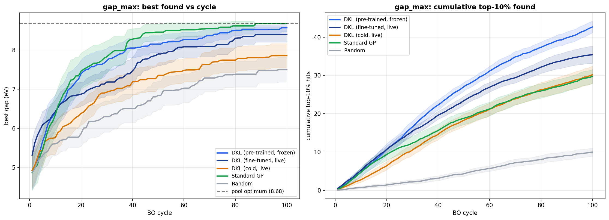
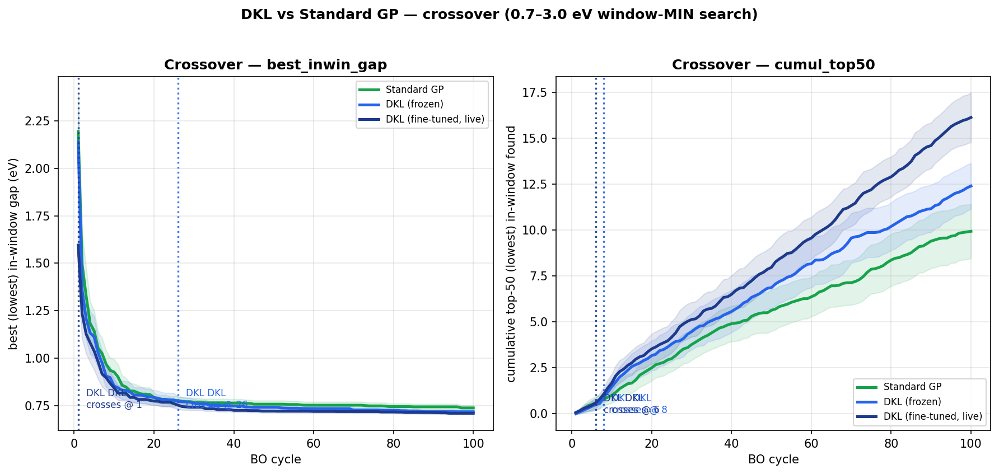

# DKL-BO for 2D Materials Discovery

**Deep Kernel Learning Bayesian Optimisation for discovering high-value 2D materials in the C2DB database.**

C2DB crystal structures → CGCNN crystal graphs → a Gaussian Process with a *learned* deep kernel → Bayesian Optimisation that finds rare, valuable materials while testing as few candidates as possible.

This repository reproduces and extends **Kiyohara & Kumagai (2025)** on the **C2DB** (Computational 2D Materials Database), with vacuum-aware crystal graphs, a single shared benchmark dataset, formal significance testing, and a clean pre-training ablation.

---

## Table of Contents

- [Motivation](#motivation)
- [Key idea: learned features vs. handcrafted descriptors](#key-idea-learned-features-vs-handcrafted-descriptors)
- [Method & architecture](#method--architecture)
- [Headline results](#headline-results)
- [Repository structure](#repository-structure)
- [Installation](#installation)
- [Data](#data)
- [Reproducing the results](#reproducing-the-results-end-to-end)
- [Results in detail](#results-in-detail)
- [Generalisation study (SNUMAT)](#generalisation-study-snumat)
- [Design decisions](#key-design-decisions)
- [References](#references)
- [Citation](#citation)

---

## Motivation

Measuring one property of one material — say the band gap of a new 2D crystal — means a **DFT calculation** costing hours to days, or a physical experiment costing far more. We cannot afford to test every candidate. We want to find the **best** materials while testing as **few** as possible.

This is **Bayesian Optimisation (BO)**: predict a property *cheaply* from structure, use that prediction **and its uncertainty** to choose the single most promising material to test next, reveal its true value, learn, and repeat.

Because C2DB already contains DFT-computed answers, we can *simulate* a discovery campaign honestly: hide the labels, let the algorithm request them one at a time, and measure how quickly it finds the rare, valuable materials. An open-ended scientific search becomes a **reproducible, measurable benchmark**.

**Properties searched** (both `max` and `min` directions):

| Target | Meaning | Why it matters |
|---|---|---|
| **Band gap** (`gap`, HSE06) | energy gap between filled and empty electron states | sets metal / semiconductor / insulator → electronics, optics, photovoltaics |
| **Effective mass** (`emass`) | how "heavy" charge carriers behave | low effective mass → high mobility → faster transistors |

---

## Key idea: learned features vs. handcrafted descriptors

A standard Gaussian-Process optimiser (**Std-GP-BO**) needs a human to hand it **descriptors** — a fixed list of numbers describing each material. The whole search is then capped by how good those handcrafted numbers happen to be.

> **The innovation of Deep Kernel Learning (DKL): instead of handcrafted descriptors, a Crystal Graph Convolutional Neural Network (CGCNN) *learns* the feature representation directly from the atomic structure — jointly with the Gaussian Process that uses it.** The network is trained to produce exactly the embedding that makes the GP predict and quantify uncertainty best.

In one line: **Std-GP reads a recipe card someone else wrote; DKL looks at the raw ingredients and learns what matters.**

This project is a fair, statistically-tested contest between three methods:

| Method | Features | Role |
|---|---|---|
| **Random** | — | the floor everyone must beat |
| **Std-GP** | 43 handcrafted descriptors (35 composition + 8 structural) | the traditional approach |
| **DKL-BO** | a CGCNN-learned 32-dim embedding | the key innovation |

All three share the **same GP engine**, the **same acquisition rule**, and — per seed — the **same starting materials**, so any difference is caused *only by the features*.

---

## Method & architecture

```
Crystal structure (atoms + bonds, from C2DB)
        │
        ▼
CGCNN encoder            src/dklbo/models/cgcnn_encoder.py
  • atom features: 90-dim one-hot (element Z)
  • bond features: 10-dim Gaussian basis of bond distance
  • 3 graph-convolution layers, hidden dim 32
  • attention pooling  →  one 32-dim crystal "fingerprint"
        │  (32-dim embedding)
        ▼
Gaussian Process         src/dklbo/models/surrogate.py
  • ExactGP, Matérn-5/2 kernel, ARD (per-feature length scales)
  • outputs mean μ (predicted property) + std σ (uncertainty)
        │
        ▼
Acquisition function     src/dklbo/bo/acquisition.py
  • Expected Improvement (main contest); UCB / window variants available
        │
        ▼
BO loop                  src/dklbo/bo/loop.py
  pick best-scoring material → reveal its true value (oracle lookup)
  → add to training set → retrain → repeat
```

**Std-GP** uses the *same* GP and acquisition — it simply replaces the 32-dim learned embedding with the 43 handcrafted descriptors. **DKL = encoder + GP, trained jointly**, so the embedding is "GP-aware": the network learns features that make the GP's *uncertainty* trustworthy, not just its point predictions.

**The critical 2D fix.** A 2D material is a thin sheet (~3–6 Å) in a tall box with ~15–20 Å of vacuum along the c-axis. A naive neighbour search creates **false bonds across the vacuum gap**. The graph builder drops any edge whose z-displacement `|Δz|` exceeds `vacuum_cutoff = 4.0 Å` — the project's most important correctness check (unit-tested in `tests/test_vacuum_cutoff.py`).

**Graph caching.** Graphs are built once and stored in a single **LMDB** database named `graphs_<hash>.lmdb`, where `<hash>` is an MD5 of the preprocessing config. Change any preprocessing parameter and the hash changes — you can never silently train on stale graphs.

---

## Headline results

Fair contest on a shared **2,667-material** intersection dataset (held-out pool of 766), Expected Improvement acquisition, 10 starter + 100 guided digs, verified with **paired Wilcoxon tests + bootstrap 95% CIs** over 10 and 30 seeds.

1. **DKL's signature strength is discovery breadth — harvesting *many* rare materials.** It **significantly** out-discovers descriptors for **maximum band gap**: top-10% **42 vs 30**, *p ≈ 0.002*, confirmed at 30 seeds (*p ≈ 2 × 10⁻⁶*). This is the rock-solid headline.
2. **DKL's cleanest all-round victory is the low-gap window search** — it wins both the single best *and* breadth, frozen *and* fine-tuned, all statistically significant — exactly where handcrafted descriptors are weak.
3. **Pre-training is essential.** Strip it out (cold start) and DKL significantly *loses* on band gap — the win comes from the representation learned on 1,901 materials, not architecture alone.
4. **Search ≠ accuracy.** DKL beats descriptors at *finding* high-gap materials even though its pointwise prediction R² is no better — the project's central thesis, matching the reference paper.
5. **Honest limits.** Std-GP stays competitive or better for single-champion hunts and for maximum effective mass; gap-minimisation and raw effective-mass tasks are statistical **ties** at our seed counts. We claim *where* and *why* DKL wins — not "DKL wins everywhere."

<p align="center">
  
  
</p>

*Left: the headline gap-max result (best-found and cumulative top-10% vs. BO cycle, 95% CI bands). Right: the low-gap-window crossover, DKL's cleanest win.*

---

## Repository structure

```
DKL-BO/
├── src/dklbo/                 # the reusable engine (installable package)
│   ├── data/                  #   graph_builder.py (vacuum-aware graphs), cache.py (LMDB), c2db_loader.py
│   ├── models/                #   cgcnn_encoder.py, surrogate.py (GP), dkl.py
│   ├── bo/                    #   loop.py, acquisition.py, baselines.py
│   ├── baselines/             #   feature_bo_loop.py, descriptors.py (Std-GP)
│   └── eval/                  #   accuracy + calibration metrics
├── scripts/                   # the rebuild pipeline (plain Python, numbered 01–07)
│   ├── 01_build_dataset.py    #   Phase 1: build the shared dataset + descriptors + split
│   ├── 02_pretrain_encoder.py #   Phase 2: train + freeze a CGCNN encoder per target
│   ├── 03_eval_accuracy.py    #   Phase 2: offline prediction accuracy (Std-GP vs DKL)
│   ├── 03b_emass_scale_compare.py
│   ├── 04_run_bo.py           #   Phase 3: the BO contest (frozen DKL vs Std-GP vs Random)
│   ├── 05_run_bo_finetune.py  #   Phase 4: live fine-tuning + cold-start control
│   ├── 06_stats.py            #   Phase 5: Wilcoxon tests + bootstrap CIs
│   ├── 07_plot.py             #   Phase 5: convergence curves + bar charts
│   └── exp_*.py               #   Phase 6 extensions: epoch sweep, window searches
├── configs/                   # experiment / model / acquisition configs
├── results/rebuild/           # all outputs: run CSVs, stats, plots, encoders, embeddings
├── report/                    # written report (.docx) + publication figures
├── docs/rebuild/              # full narrative explanations (start here to understand the science)
├── snumat_generalization/     # side-study: repeat the contest on a 2nd (3D) dataset
├── tests/                     # correctness tests (vacuum filter, BO loop, surrogate swap)
└── pyproject.toml
```

> **Best place to understand the science end-to-end:** [`docs/rebuild/DKL-BO_full_project_explanation.md`](docs/rebuild/DKL-BO_full_project_explanation.md), with per-phase companions in the same folder.

---

## Installation

Requires Python ≥ 3.10.

```bash
git clone https://github.com/Akhillavudya/DKL-BO.git
cd DKL-BO

python -m venv venv
source venv/bin/activate

pip install -e .          # installs the dklbo package + pinned dependencies
```

Key dependencies (see `pyproject.toml`): `torch`, `torch-geometric`, `gpytorch`, `botorch`, `ase`, `pymatgen`, `scikit-learn`, `lmdb`, `pandas`, `matplotlib`.

Run the tests to confirm the install:

```bash
pytest
```

---

## Data

The pipeline reads the **C2DB** database (an ASE `.db` file). It is **not** redistributed here (licensing + size); place it at `data/raw/c2db.db` or pass `--db_path`.

Derived artefacts live under `data/cache/` and are **git-ignored** (regenerated by Phase 1):

| File | Contents |
|---|---|
| `data/cache/master.parquet` | 2,667 materials: `id, uid, formula, prototype, gap, emass, n_atoms, split` |
| `data/cache/descriptors.parquet` | 2,667 × 43 handcrafted descriptors (Std-GP features), row-aligned |
| `data/cache/graphs_<hash>.lmdb` | cached CGCNN crystal graphs (built once, reused everywhere) |

> C2DB gives a band gap for ~3,351 non-metals but a valid effective mass for only ~2,667. We keep the **intersection** — materials with **both** a valid gap and a valid emass — so all studies search the *identical* pool and are directly comparable.

---

## Reproducing the results (end to end)

The pipeline is a left-to-right sequence; each phase produces the ingredients the next consumes. All outputs land in `results/rebuild/`.

```bash
# Phase 1 — build ONE shared dataset (master table + 43 descriptors + prototype-aware split),
#           reuse the graph cache, and verify Std-GP/DKL cover the same materials in the same order.
python scripts/01_build_dataset.py --db_path data/raw/c2db.db

# Phase 2 — train + freeze one CGCNN encoder per target, then grade offline prediction accuracy.
python scripts/02_pretrain_encoder.py --target gap
python scripts/02_pretrain_encoder.py --target emass --log      # emass is modelled on log10 scale
python scripts/03_eval_accuracy.py                              # → accuracy.csv + plots/accuracy.png

# Phase 3 — the BO contest: 4 tasks × {Std-GP, DKL-frozen, Random} × 10 seeds × 100 cycles.
python scripts/04_run_bo.py                                     # → runs/, bo_summary.csv
#   quick smoke test:  python scripts/04_run_bo.py --seeds 1 --cycles 5

# Phase 4 — live fine-tuning + cold-start control (the pre-training story).
python scripts/05_run_bo_finetune.py                           # pretrained encoder, fine-tuned in the loop
python scripts/05_run_bo_finetune.py --cold                    # random-init encoder trained from scratch

# Phase 5 — statistics + plots.
python scripts/06_stats.py                                     # paired Wilcoxon + bootstrap 95% CIs
python scripts/07_plot.py                                      # convergence curves + bar charts

# Phase 6 — extensions (optional): 30-seed re-run, encoder epoch sweep, window searches.
python scripts/04_run_bo.py --seeds 30
python scripts/07_plot.py --outdir results/rebuild/plots_30seed
python scripts/exp_epoch_sweep.py
python scripts/exp_window_min_bo.py
python scripts/exp_window_max_bo.py
```

Each BO script is **idempotent** — completed run CSVs are skipped on re-run, so you can resume interrupted campaigns.

---

## Results in detail

### Offline prediction accuracy (held-out 766-material pool)

| Target | Std-GP | DKL |
|---|---|---|
| **gap** (R² / coverage@95) | **0.604** / 0.948 | 0.546 / 0.898 |
| **emass** log10 (R²_log) | 0.125 | **0.136** |

For band gap, descriptors are *slightly* the better, better-calibrated predictor. For effective mass **neither** predicts well (R² ≈ 0), but in log space **DKL edges ahead** — the first hint that where descriptors are physically weak, learned features start to win. Crucially, weak accuracy does **not** imply a weak search (**search ≠ accuracy**).

### The BO contest (mean over 10 seeds; best / top-50 / top-10%)

| Task | Method | best | top-50 | top-10% |
|---|---|---|---|---|
| **gap_max** | Std-GP | 8.671 | 21.3 | 29.4 |
| | **DKL** | 8.638 | **32.0** | **42.4** |
| | Random | 7.332 | 6.4 | 9.8 |
| **gap_min** | Std-GP | 0.022 | 19.4 | 28.7 |
| | DKL | 0.023 | 19.8 | 27.1 |
| **emass_min** | Std-GP | **−1.999** | 16.5 | 21.8 |
| | DKL | −1.714 | **18.9** | **24.1** |
| **emass_max** | **Std-GP** | **1.696** | **16.2** | **21.0** |
| | DKL | 1.455 | 12.6 | 16.8 |

### Statistical verdict (paired Wilcoxon, p < 0.05)

| Task | Finding | p |
|---|---|---|
| gap_max | **DKL-frozen beats Std-GP on top-10%** (42 vs 29) | **0.002** |
| gap_max | DKL-frozen beats Std-GP on top-50 | 0.002 |
| gap_max | DKL-finetune beats Std-GP on top-10% / top-50 | 0.016 / 0.012 |
| gap_max | cold-start **loses** on best & regret-AUC → pre-training required | 0.031 / 0.037 |
| window-min | **DKL wins BOTH best AND breadth, frozen AND fine-tuned** | ≈ 2 × 10⁻⁵ |

**Everything else — gap_min and both raw emass tasks — is statistically tied with Std-GP at 10 seeds.** The 30-seed re-run confirms the gap_max win (top-10% 42.7 vs 29.8, *p ≈ 2 × 10⁻⁶*) and leaves the ties unchanged.

**Frozen vs fine-tuned, in one line:** frozen = best **breadth**; fine-tuned = best **single champion / sample-efficiency** (but overfits the few labels and loses breadth).

---

## Generalisation study (SNUMAT)

[`snumat_generalization/`](snumat_generalization/) repeats the whole contest on a **second, independent dataset** — 3D ICSD crystals from SNUMAT, band gap only — to test whether the "DKL wins breadth" finding *generalises* beyond C2DB and beyond 2D materials. It is self-contained (its own `data/`, `scripts/`, `results/`, `README.md`); its large graph cache is git-ignored.

---

## Key design decisions

- **Single intersection dataset** (2,667 materials with both gap and emass) → all studies directly comparable.
- **Prototype-aware, gap-stratified split** (train = 1,901 / pool = 766) → no near-duplicate structural leakage; rare extremes deliberately placed in the held-out pool.
- **Vacuum cutoff = 4.0 Å** → kills physically meaningless bonds across the 2D vacuum gap.
- **No validation set inside the BO loop** (following both reference papers) → the pool is a pristine exam; a tiny val split is carved from *train* only, for encoder pre-training.
- **One encoder per property** → features good for gap differ from those good for emass.
- **log10(emass)** → emass spans 5 orders of magnitude; log scale helps both methods.
- **Expected Improvement** for the main contest → parameter-free, fairer than tuning UCB's β.

---

## References

- **[P1] S. Kiyohara & Y. Kumagai** — *Bayesian Optimization with Gaussian Processes Assisted by Deep Learning for Material Designs.* J. Phys. Chem. Lett. **2025**, 16, 5244–5251. — direct template (CGCNN + GP, Matérn-5/2, attention pooling). Code: `github.com/skiyohara/dklbo`.
- **[P2] Mamun, Yang & Yue** — DGKL: scaling (SVGP) + calibration / uncertainty quantification.
- **[P3] Lyu et al. (2023)** — transfer-learning strategy (pre-train on abundant property → fine-tune on a sparse target).
- **C2DB** — Computational 2D Materials Database (Haastrup et al.).

---

## Citation

If this repository is useful, please cite the reference method and this implementation:

```bibtex
@article{kiyohara2025dklbo,
  title   = {Bayesian Optimization with Gaussian Processes Assisted by Deep Learning for Material Designs},
  author  = {Kiyohara, Shin and Kumagai, Yu},
  journal = {The Journal of Physical Chemistry Letters},
  volume  = {16},
  pages   = {5244--5251},
  year    = {2025}
}

@software{dklbo_c2db,
  title  = {DKL-BO for 2D Materials Discovery (C2DB)},
  author = {Lavudya, Akhil},
  url    = {https://github.com/Akhillavudya/DKL-BO},
  year   = {2026}
}
```
